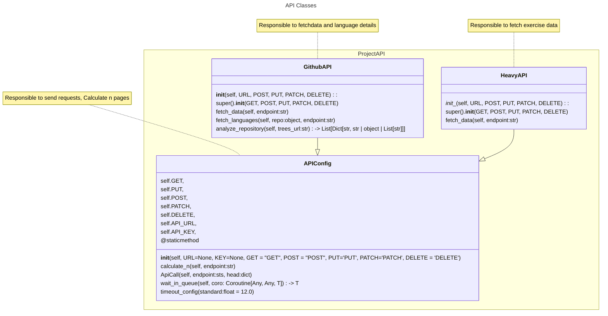

#   Visual representation of the API Classes

```mermaid
---
title: API Classes
---
 classDiagram

    %% Relationship
    GithubAPI --|>  APIConfig
    HeavyAPI  --|>  APIConfig

    note for HeavyAPI "Responsible to fetch exercise data"
    note for GithubAPI "Responsible to fetchdata and language details"
    note for APIConfig "Responsible to send requests, Calculate n pages"

    namespace Project API{

        class APIConfig {
            self.GET,
            self.PUT,
            self.POST,
            self.PATCH,
            self.DELETE,
            self.API_URL,
            self.API_KEY,
        
            __init__(self, URL=None, KEY=None, GET = "GET", POST = "POST", PUT='PUT', PATCH='PATCH', DELETE = 'DELETE')
            calculate_n(self, endpoint:str)
            ApiCall(self, endpoint:sts, head:dict)
            wait_in_queue(self, coro: Coroutine[Any, Any, T]) -> T

            @staticmethod
            timeout_config(standard:float = 12.0)
            }

        class HeavyAPI{
            _init__(self, URL, POST, PUT, PATCH, DELETE):
                super().__init__(GET, POST, PUT, PATCH, DELETE)
            fetch_data(self, endpoint:str)
            }

        class GithubAPI{
            __init__(self, URL, POST, PUT, PATCH, DELETE):
                super().__init__(GET, POST, PUT, PATCH, DELETE)
            fetch_data(self, endpoint:str)
            fetch_languages(self, repo:object, endpoint:str)
            analyze_repository(self, trees_url:str) -> List[Dict[str, str | object | List[str]]]
        }

    }
```
