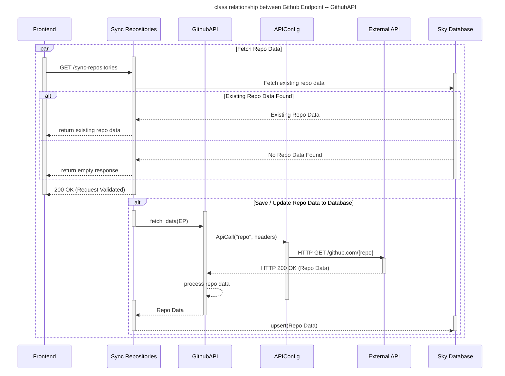

##  Relationship between Github endpoint and REST API

```mermaid
---
title: class relationship between Github Endpoint -- GithubAPI
---
sequenceDiagram
    participant Frontend as Frontend
    participant EP as Sync Repositories
    participant GAPI as GithubAPI
    participant AC as APIConfig
    participant Ext as External API
    participant DB as Sky Database

    par Fetch Repo Data
        activate EP
        activate Frontend
        Frontend->>EP: GET /sync-repositories

        activate DB
        EP->>DB: Fetch existing repo data
        alt Existing Repo Data Found
            DB-->>EP: Existing Repo Data
            EP-->>Frontend: return existing repo data

        else
            DB-->>EP: No Repo Data Found
            EP-->>Frontend: return empty response
        end

        deactivate DB
        EP-->>Frontend: 200 OK (Request Validated)
        deactivate EP
        deactivate Frontend

        alt Save / Update Repo Data to Database
            activate EP
            activate GAPI
            EP->>GAPI: fetch_data(EP)
            deactivate EP

            GAPI->>AC: ApiCall("repo", headers)
            activate AC
            AC->>Ext: HTTP GET /github.com/{repo}
            activate Ext
            Ext-->>GAPI: HTTP 200 OK (Repo Data)
            deactivate Ext
            GAPI-->>GAPI: process repo data
            deactivate AC
            activate EP
            GAPI-->>EP: Repo Data
            deactivate GAPI
            activate DB
            
            EP -->> DB: upsert(Repo Data)
            deactivate DB
            deactivate EP
        end
    end

```