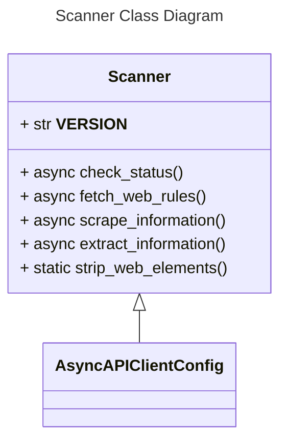

```mermaid
---
title: Scanner Class Diagram
---
classDiagram
    Scanner <|-- AsyncAPIClientConfig

    class Scanner {
        + str __VERSION__
        + async check_status()
        + async fetch_web_rules()
        + async scrape_information()
        + async extract_information()
        + static strip_web_elements()
    }
```