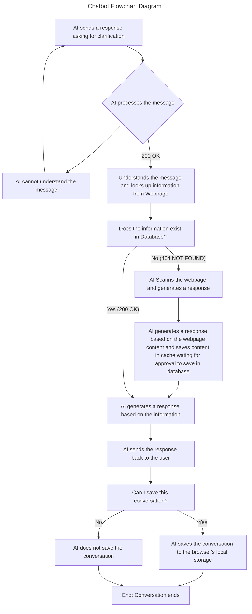

```mermaid
---
title: Chatbot Flowchart Diagram
---
flowchart TD
    A[Start: User sends a message] --> B{AI processes the message}
    B --> C1[AI cannot understand the message]
    C1 --> A[AI sends a response asking for clarification]
    B -- 200 OK --> C[Understands the message and looks up information from Webpage]
    C --> D[Does the information exist in Database?]
    D -- No (404 NOT FOUND) --> D1[AI Scanns the webpage and generates a response]
    D1 --> E1[AI generates a response based on the webpage content and saves content in cache wating for approval to save in database]
    E1 --> E
    D -- Yes (200 OK) --> E[AI generates a response based on the information]
    E --> F[AI sends the response back to the user]
    F --> G[Can I save this conversation?]
    G -- Yes --> H[AI saves the conversation to the browser's local storage]
    G -- No --> H1[AI does not save the conversation]
    H --> I
    H1 --> I[End: Conversation ends]
```