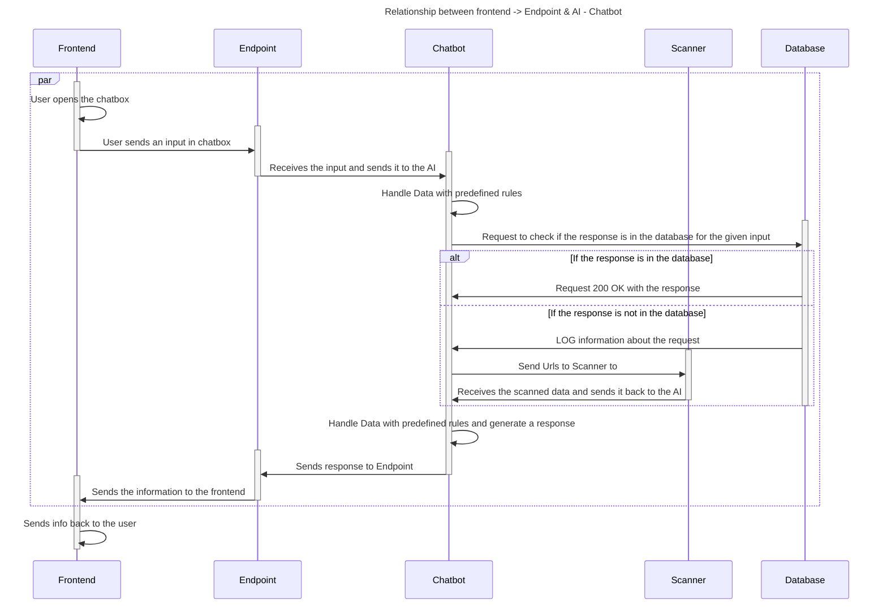

```mermaid
---
title: Relationship between frontend -> Endpoint & AI - Chatbot
---
sequenceDiagram
    participant FE as Frontend
    participant EP as Endpoint
    participant AI as Chatbot
    participant SCAN as Scanner
    participant DB as Database

    par
        activate FE
        FE ->> FE: User opens the chatbox

        activate EP
        FE ->> EP: User sends an input in chatbox
        deactivate FE

        activate AI
        EP ->> AI: Receives the input and sends it to the AI
        deactivate EP
        AI ->> AI: Handle Data with predefined rules

        activate DB
        AI ->> DB: Request to check if the response is in the database for the given input    
        alt If the response is in the database
            DB ->> AI: Request 200 OK with the response
        else If the response is not in the database
             DB ->> AI: LOG information about the request
             activate SCAN
            AI ->> SCAN: Send Urls to Scanner to
            SCAN ->> AI: Receives the scanned data and sends it back to the AI
            deactivate SCAN
        end
        deactivate DB
        AI ->> AI: Handle Data with predefined rules and generate a response

        activate EP
        AI ->> EP: Sends response to Endpoint
        deactivate AI
        activate FE
        EP->> FE: Sends the information to the frontend
        deactivate EP
    end
        FE ->> FE: Sends info back to the user
        deactivate FE
```