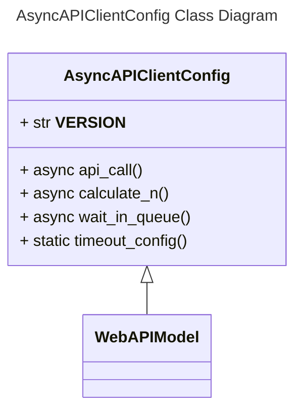

```mermaid
---
title: AsyncAPIClientConfig Class Diagram
---
classDiagram
    AsyncAPIClientConfig <|-- WebAPIModel

    class AsyncAPIClientConfig {
        + str __VERSION__
        + async api_call()
        + async calculate_n()
        + async wait_in_queue()
        + static timeout_config()
    }
```