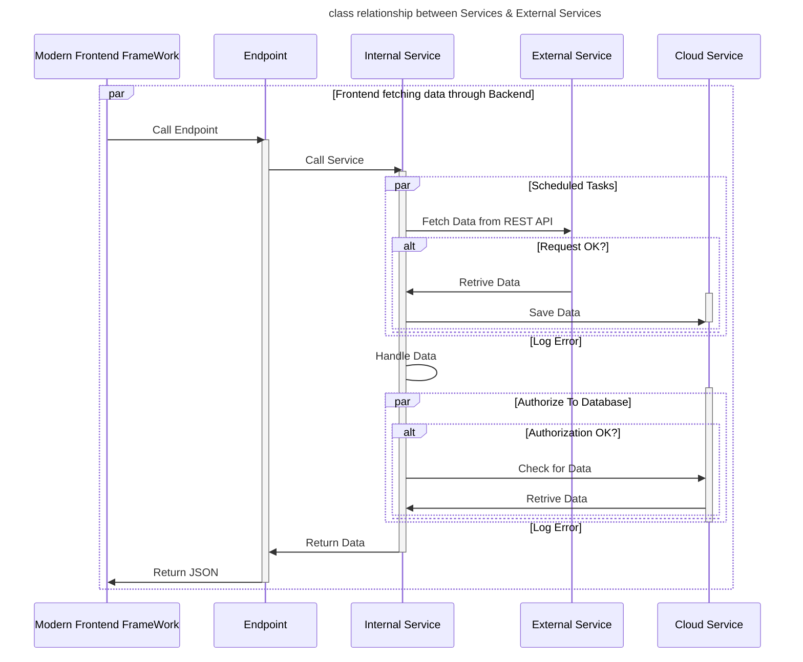

#   Visual representation of endpoint classes
```mermaid
---
title: API Classes
---

 classDiagram

    Announcements .. UtilityTools"
    
    note for Github "Responsible for fetching data from Github API, 
    Utilizing APILogger to log interactions and error"
    
    note for PhotoLibrary "Responsible for fetching Photos, 
    Utilizing APILogger to log interactions and error"
    
    note for Announcements "Responsible for fetching data from UtilityTools.Announcements, 
    Utilizing APILogger to log interactions and error"

    class Github{
        APILogger
        def get()
    }
    class PhotoLibrary {
        APILogger
        def get()
    }

    class Announcements {
        APILogger
        def get()
    }
```

##  Relationship between Frontend and Backend Services 


##  Relationship between Announcement endpoint and Utils.Announcement
```mermaid
---
title: class relationship between Announcement Endpoint -- Announcement Data
---
sequenceDiagram
    participant FE as Fronend
    participant EP as Endpoint
    participant API as Utils

    FE->>EP: axios.get()
    EP->>API: Announcement(date)
    activate API
    API->>EP: return message
    EP->>FE: displayAnnouncement()
``````