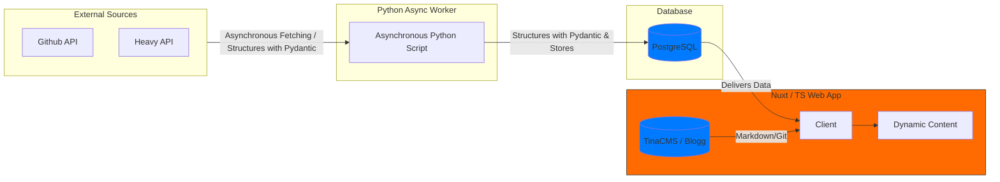

```mermaid
graph LR
    subgraph external_services [External Sources]
        API1[Github API]
        API2[Heavy API]
    end

    subgraph backend [Python Async Worker]
        Python[Asynchronous Python Script]
    end

    subgraph database [Database]
        Postgres[(PostgreSQL)]
    end

    subgraph frontend [Nuxt / TS Web App]
        Nuxt[Client]
        Nuxt --> Dynamic[Dynamic Content]
        Tina[(TinaCMS / Blogg)]
    end

    external_services -- Asynchronous Fetching / Structures with Pydantic --> Python
    Python -- Structures with Pydantic & Stores --> Postgres
    Postgres -- Delivers Data --> Nuxt
    Tina -- Markdown/Git --> Nuxt

    style Tina fill: #007BFF
    style Postgres fill:#007BFF
    style frontend fill:#FF6B00,stroke:#333
```