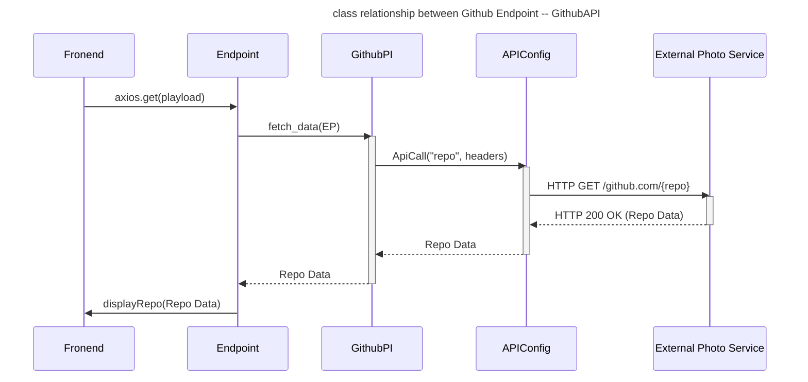
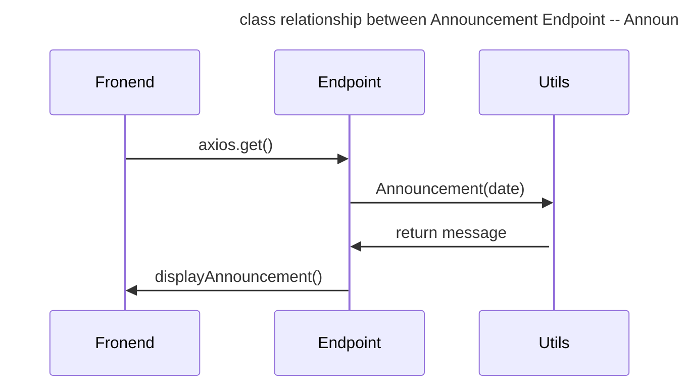

```mermaid
---
title: class relationship between Github Endpoint -- GithubAPI
---
sequenceDiagram
    participant FE as Fronend
    participant EP as Endpoint
    participant API as GithubPI
    participant AC as APIConfig
    participant Ext as External Photo Service

    FE->>EP: axios.get(playload)
    EP->>API: fetch_data(EP)
    activate API
    API->>AC: ApiCall("repo", headers)
    activate AC
    AC->>Ext: HTTP GET /github.com/{repo}
    activate Ext
    Ext-->>AC: HTTP 200 OK (Repo Data)
    deactivate Ext
    AC-->>API: Repo Data
    deactivate AC
    API-->>EP: Repo Data
    deactivate API
    EP->>FE: displayRepo(Repo Data)
```

##  Relationship between Announcement endpoint and Utils.Announcement

```mermaid
---
title: class relationship between Announcement Endpoint -- Announcement Data
---
sequenceDiagram
    participant FE as Fronend
    participant EP as Endpoint
    participant API as Utils

    FE->>EP: axios.get()
    EP->>API: Announcement(date)
    activate API
    API->>EP: return message
    EP->>FE: displayAnnouncement()
```