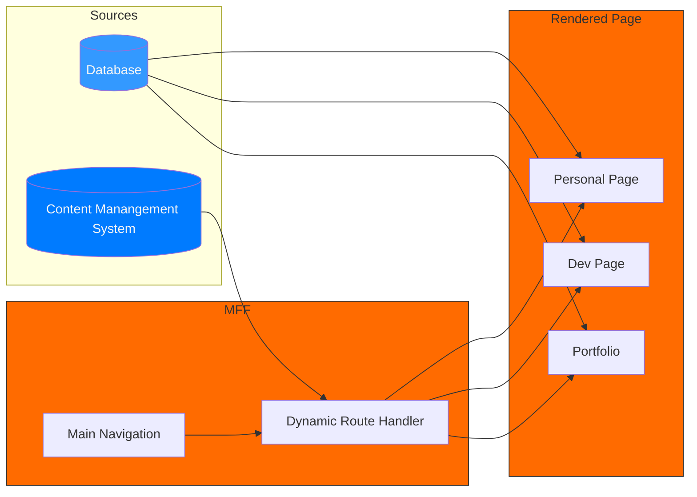

```mermaid
graph LR
    %% Participants
    Sources[External Data]
    DB[(Database)]
    Tina[(Content Manangement System)]

    MFF[Modern Framework SSR Engine]
    NAV[Main Navigation]
    Router[Dynamic Route Handler]

    Pages
    LP[Portfolio]
    DEV[Dev Page]
    ME[Personal Page]

    subgraph Sources
        DB:::Data
        Tina:::Data
    end

    subgraph MFF
        NAV --> Router
    end

    subgraph Pages[Rendered Page]
        LP:::Router
        DEV:::Router
        ME:::Router
    end

    %% Connections
    Tina --> Router
    Router --> LP
    Router --> DEV
    Router --> ME

    DB --> LP
    DB --> DEV
    DB --> ME

    %% Style
    style MFF fill:#FF6B00, stroke:#333
    style Pages fill:#FF6B00, stroke:#333
    style DB fill:#3399ff, color:#f5f5f5
    style Tina fill:#007BFF, color:#f5f5f5
```