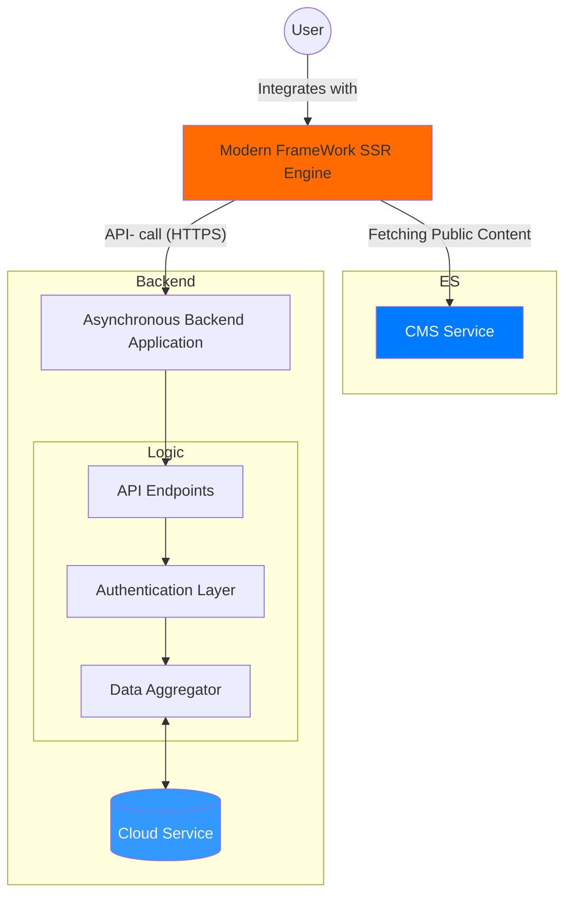

```mermaid
graph TD
    User((User))
    MFF[Modern FrameWork SSR Engine]

    CMS[CMS Service]
    ES[External Services]

    Python[Asynchronous Backend Application]
    Logic[Application Logic]
    Endpoints[API Endpoints]
    Data[Data Aggregator]
    Auth[Authentication Layer]

    %% Bruker og MFF
    User -->|Integrates with| MFF

    subgraph ES
        CMS
    end

    subgraph Backend
        %% Python Backend Applikasjon
        Python

        subgraph Logic
            Endpoints
            Data
            Auth
        end

        DB[(Cloud Service)]
    end

    %% Datastrømmer
    MFF -- "Fetching Public Content" --> CMS
    MFF -- "API- call (HTTPS)" --> Python

    %% Intern flyt i backend
    Python --> Endpoints
    Endpoints --> Auth
    Auth --> Data
    Data <--> DB

    %% Stilering
    style MFF fill: #FF6B00
    style DB fill:#3399ff,color:#f5f5f5
    style CMS fill:#007BFF,color:#f5f5f5
```